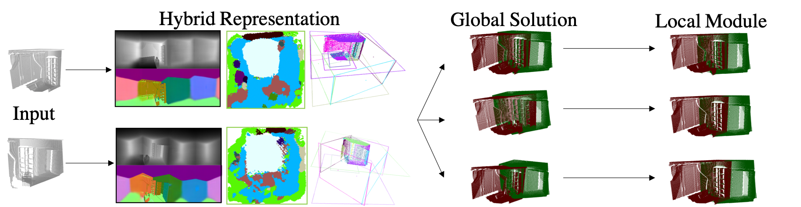

## Extreme Relative Pose Network under Hybrid Representations

Implementation of Paper "Extreme Relative Pose Network under Hybrid Representations".



## Prerequisites:
* pytorch (>0.4)
* open3d
* scipy,sklearn
* [torchvision](https://github.com/warmspringwinds/vision/tree/eb6c13d3972662c55e752ce7a376ab26a1546fb5)

##  Folder Organization
please make sure to have following folder structure:
``` shell
Hybrid_Relative_Pose/
    data/
        dataList/
        eval/
            plane_data/
            topdown_data/
            test_data/
        pretrained_model/
            global/
                360_image/
                plane/
                topdown/
            local/
    experiments/
```

##  Dataset Download
**Images**: [suncg](https://drive.google.com/open?id=1Gr-BLYrMm7zM_Q0rum_uKM_TwMJg10Mf),[matterport](https://drive.google.com/open?id=12PcZK89YX7zbR2sP_vjT-n8NyqakNNge),[scannet](https://drive.google.com/open?id=1lwF7gTQg4rS5-lJ-cVXHf7Uch0vRvoc1).<br/> 
**Datalist**: Download [datalist](https://drive.google.com/open?id=1OtViLAOFcOLfnv-oR0vZv7uGRUlWz_3K) and put them under data/datalList/. <br/>
**Pretrained model**: Download [pretrained model](https://drive.google.com/open?id=1yX2h5zhRwm1wTv40tB4c9Nj42Z6U3g_L) and put them under data/pretrained_model/.<br/>
**Relative Pose data**: Download Relative pose [test data](https://drive.google.com/open?id=1wnB7pmjKkn_FHuMAX7zKsRp8DSqILr62) and put them under data/eval/.<br/>

## Usage

#### Generate randomly sampled data
```
python generate_testdata.py --exp fd_param --dataset={suncg,scannet,matterport} --snumclass={15,21,21} --split=test
```

#### Global Relative pose evaluation module
```
python eval_spectral.py --dataList={suncg,scannet,matterport} --method=ours --exp=test_code --fitmethod irls_sm_v2 --d 1 --hybrid 1 --hybrid_method 360+plane+topdown --numMatches {1,3,5} --w_plane_1 {1.44,2.05,2.00} --w_topdown {0.25,0.29,0.30}
```

#### Local module
```
python local_inference.py --model=./data/pretrained_model/local/{suncg,scannet,matterport}.tar --batch_size=12 --resume --enable_training=0 --eval_local=1 --local_eval_list=data/dataList/{suncg,scannet,matterport}_local.npy --dataList={suncg,scannet,matterport}
```

#### Run baseline models:
4pcs and Global Registration model:
```
python run_baseline.py --dataset={scannet, suncg, matterport} --method={4pcs, gr}
```
Baseline local model:
```
python baseline_icp.py --dataset {suncg,scannet,matterport} --global_method {ours,gr}
```
## Author

Zhenpei Yang and Siming Yan
